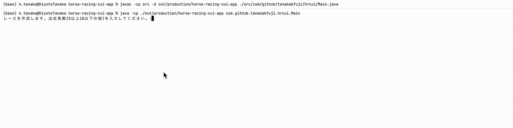

# 競馬CUIアプリ

## 概要

競馬のレースをCUI上でシミュレートするアプリケーション（ゲーム）です。
ゲーム自体は、ゲーム開始の画面、出走表表示の画面、レース進行の画面、レース結果の画面という4つのシンプルな構成です。
馬の順位を予想し、CUI上で競馬観戦を楽しむことができます。

バージョン: OpenJDK-23.0.2

## 実際のゲーム画面



## 起動方法

- コンパイル

```Bash
javac -d out/production/horse-racing-cui-app -cp src ./src/com/github/tanakakfuji/hrcui/Main.java
```

- 実行

```Bash
java -cp out/production/horse-racing-cui-app com.github.tanakakfuji.hrcui.Main
```

## 開発背景

- オブジェクト指向プログラミングを学んだ後のアウトプットとして開発したい。
    - これまでやってきたWebアプリ開発では、MVCモデルなどのフレームワークに従って、思考停止状態で、Controllerのコードを手続き的に書いていただけ。
    - オブジェクト指向の本質である現実世界を模倣したプログラムで、エンジニアらしくクラス設計をするのが目的。
- 学生の間に大規模なゲームを開発したというインパクトを残したい。
    - 大学生活の集大成にできたら良い。
- 周りの友達が競馬にハマっているが、ゲームで楽しめればお金を使わずに済む。
    - レースの雰囲気を味わえるゲームにする。

## 実装しなかった要素

- コースの形状
    - CUI上で表現する都合上、一直線のコースにする。
- 初速
    - 本来スタートしてから徐々に競争馬は加速するが、複雑になるため実装しない。
- 根性
    - レース中の競り合いを表現するのは、複雑になるため実装しない。
- 騎手
    - 今回は、馬の能力だけを表現したいため実装しない。
- プレイヤー・オッズ
    - 所持金や賭け金の概念も取り入れたいが、複雑になるため実装しない。
- 予想家による順位予想
    - 学習済みのAIモデルに予想させるといったことが考えられるが、複雑になるため実装しない。

今回実装しなかった要素は、今後、GUIアプリとして開発する時に実装することを考える。

## クラス図

